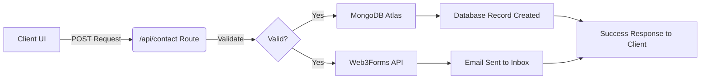

<div align="center">
  <h1>⚡ Usman Khalid | Modern Developer Portfolio</h1>
  <p>A premium, high-performance portfolio website built with modern web technologies to showcase professional experience, skills, and projects.</p>

  <div>
    
    
    
    
    
  </div>

  <br />

</div>

---

## 📖 Table of Contents

- [Overview](#-overview)
- [Key Features](#-key-features)
- [System Architecture](#-system-architecture)
- [Tech Stack](#-tech-stack)
- [Getting Started](#-getting-started)
- [Project Structure](#-project-structure)
- [Customization](#-customization)
- [Deployment](#-deployment)
- [Contact](#-contact)

---

## 🌟 Overview

Welcome to my personal developer portfolio! This project was designed from the ground up to be a stunning visual representation of my work as a **Full-Stack MERN Developer**.

Moving away from standard templates, this portfolio leverages the **Next.js App Router** for lightning-fast server-side rendering, combined with **Framer Motion** for butter-smooth micro-interactions. The design system relies on a sophisticated **Sea Blue (`#006994`) & Pure Black (`#000000`)** color palette, incorporating modern glassmorphism and subtle scroll effects.

---

## 🚀 Key Features

### 🎨 Premium Design & UI

- **Glassmorphism Elements**: Cards, navigation bars, and overlays feature beautiful frosted glass effects utilizing backdrop-blur.
- **Responsive Mobile-First Architecture**: 100% fluid design that looks pixel-perfect on mobile devices, tablets, and massive desktop monitors.
- **Dynamic Theming**: Seamless toggling between Light and Dark modes with automatic persistence in local storage.

### ✨ Immersive Animations

- **Magnetic UI Elements**: Buttons and key links physically pull towards the user's cursor on hover for a tactile experience.
- **Orchestrated Scroll Reveals**: Content dynamically fades in, slides up, and staggers into place as the user naturally scrolls down the page.
- **Interactive Typography**: Character-by-character SplitText reveals and Typewriter effects for high-impact headlines.
- **Custom Cursor**: A stylized, fluid custom cursor that replaces the default browser pointer and reacts to clickable elements.

### ⚡ Robust Backend Capabilities

- **Serverless API Routes**: Powered by Next.js API routes for secure backend processing.
- **Integrated Contact Form**:
  - Validates user input cleanly on the frontend.
  - Submits data to a secure `/api/contact` endpoint.
  - Sends immediate email notifications using **Web3Forms**.
  - Persistently logs all inquiries into a **MongoDB Atlas** cloud database.

---

## 🏗 System Architecture

When a user submits a message via the Contact section, the following flow occurs securely on the backend:



---

## 🛠 Tech Stack

### Frontend

- **Framework**: [Next.js (App Router)](https://nextjs.org/)
- **UI Library**: [React 19](https://react.dev/)
- **Styling**: [Tailwind CSS v4](https://tailwindcss.com/)
- **Animations**: [Framer Motion](https://www.framer.com/motion/)
- **Icons**: [React Icons](https://react-icons.github.io/react-icons/)

### Backend & Infrastructure

- **Database**: [MongoDB Atlas](https://www.mongodb.com/) + Mongoose
- **Email Service**: [Web3Forms](https://web3forms.com/)
- **Hosting/Deployment**: [Vercel](https://vercel.com/)

---

## 🏁 Getting Started

Want to run this project on your own local machine? Follow these instructions:

### Prerequisites

- Node.js (v18 or higher recommended)
- npm, yarn, or pnpm
- A free MongoDB Atlas Account (for the database)
- A free Web3Forms API Key (for email forwarding)

### Installation

1. **Clone the repository**

   ```bash
   git clone https://github.com/Usmankhalid20/Personal-Website.git
   cd Personal-Website
   ```

2. **Install all dependencies**

   ```bash
   npm install
   ```

3. **Configure Environment Variables**
   Create a `.env` file in the root directory. This file is safely ignored by Git. Add your private credentials:

   ```env
   # Web3Forms Key for Contact Form Emails
   WEB3FORMS_ACCESS_KEY="your_web3forms_key_here"

   # MongoDB Connection String
   MONGODB_URI="mongodb+srv://<username>:<password>@cluster0.mongodb.net/portfolio?retryWrites=true&w=majority"
   ```

4. **Start the Development Server**
   ```bash
   npm run dev
   ```
   Open [http://localhost:3000](http://localhost:3000) in your browser to view the site.

---

## 📂 Project Structure

A clean, modular architecture separating components, features, and data:

```bash
Personal-Website/
├── app/                     # Next.js App Router root
│   ├── api/contact/         # Serverless API Route for the Contact Form
│   ├── globals.css          # Global Tailwind and custom CSS variables
│   ├── layout.jsx           # Root layout containing global Providers
│   └── page.jsx             # Main homepage orchestrator
├── public/                  # Public static assets
│   ├── img/                 # Application images, profile pics, thumbnails
│   └── resume/              # Downloadable PDF Resume
├── src/
│   ├── components/          # Global Reusable UI Elements
│   │   ├── layout/          # Headers, Footers, Page Transitions
│   │   └── ui/              # Buttons, Custom Cursor, DarkMode Toggles
│   ├── data/                # Hardcoded application state
│   │   ├── experienceData.js# Timeline data
│   │   ├── personalInfo.jsx # Bio and social links
│   │   ├── projectData.jsx  # Portfolio projects
│   │   └── skillData.jsx    # Tech stack arrays
│   ├── features/            # Feature-specific isolated components
│   │   ├── about/
│   │   ├── contact/
│   │   ├── experience/
│   │   ├── home/
│   │   ├── projects/
│   │   └── skills/
│   ├── hooks/               # Custom React hooks (e.g., useReducedMotion)
│   └── lib/                 # Utility functions and DB connection config
└── vercel.json              # Specific Vercel build configurations
```

---

## ⚙️ Customization Guide

Want to fork this and make it your own? Here is where to look:

- **Theme Colors**: Open `app/globals.css` and modify the `@theme` block to change the primary accent colors.
- **Your Resume**: Replace `public/resume/Usman_Khalid_CV.pdf` with your own PDF.
- **Your Photo**: Replace `public/img/profileImage.jpeg`.
- **Text & Projects**: Simply edit the files inside `src/data/` (`projectData.jsx`, `skillData.jsx`, etc.) to instantly populate the site with your own work history without touching the complex UI components.

---

## 🚀 Deployment

This project is fully configured for a 1-click deployment on **Vercel**.

1. Commit and push your code to your GitHub repository.
2. Log into [Vercel](https://vercel.com) and click **Add New Project**.
3. Import your GitHub repository. Vercel will automatically detect the Next.js framework.
4. Open the **Environment Variables** tab in Vercel settings and add:
   - `MONGODB_URI`
   - `WEB3FORMS_ACCESS_KEY`
5. Click **Deploy**.

---

## 🤝 Contributing

Contributions, issues, and feature requests are always welcome!

1. Fork the project
2. Create your Feature Branch (`git checkout -b feature/AmazingFeature`)
3. Commit your changes (`git commit -m 'feat: Add some AmazingFeature'`)
4. Push to the Branch (`git push origin feature/AmazingFeature`)
5. Open a Pull Request

---

## 📬 Contact

**Usman Khalid**  
_Full-Stack MERN Developer_

- 🔗 **LinkedIn**: [Connect with me](https://www.linkedin.com/in/usman-khalid-9a2bb72b7/)
- 🎨 **Behance**: [View my design work](https://www.behance.net/Usman2205)
- 💻 **GitHub**: [Follow my code](https://github.com/Usmankhalid20)

---

<div align="center">
  <i>Designed and developed with ❤️ by Usman Khalid. © 2026 All rights reserved.</i>
</div>
