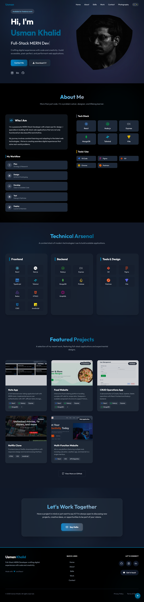

# ⚡ Modern Developer Portfolio

[](https://opensource.org/licenses/MIT)
[](https://nextjs.org/)
[](https://react.dev/)
[](https://tailwindcss.com/)
[](https://www.framer.com/motion/)
[](https://www.mongodb.com/)

> A premium, high-performance portfolio website built with **Next.js (App Router)**, **React 19**, and **Tailwind CSS v4**. Featuring a sophisticated **Sea Blue & Black** aesthetic, smooth **Framer Motion** animations, a fully functional contact form powered by **Web3Forms**, and data persistence with **MongoDB Atlas**.

<!--  -->

## 📖 Table of Contents

- [Features](#-features)
- [Tech Stack](#-tech-stack)
- [Getting Started](#-getting-started)
- [Project Structure](#-project-structure)
- [Key Components](#-key-components)
- [Customization](#-customization)
- [Deployment](#-deployment)
- [Contributing](#-contributing)
- [Contact](#-contact)

---

## 🚀 Features

### 🎨 Design & UI

- **Premium Aesthetic**: A sophisticated "Sea Blue" (`#006994`) accent color paired with a strict **Pure Black** (`#000000`) dark mode.
- **Glassmorphism**: Modern glass effects on cards and overlays using backdrop filters.
- **Responsive Layout**: Mobile-first architecture ensuring pixel-perfect rendering on phones, tablets, and desktops.
- **Dynamic Theme**: Seamless Dark/Light mode toggling with local storage persistence.

### ✨ Animations & Interactivity

- **Scroll Progress & Page Transitions**: Smooth, animated transitions between sections and pages.
- **Magnetic Buttons**: Interactive buttons that magnetically stick to the cursor movement.
- **Scroll Reveals**: Elements fade in, slide up, and stagger as you scroll down the page.
- **Split Text & Typewriter**: Character-by-character text reveal animations for impactful headlines.
- **Experience Timeline**: A beautifully animated timeline showcasing professional experience.

### ⚡ Performance & Backend

- **Next.js App Router**: Server-side rendering (SSR) and optimized routing for lightning-fast performance.
- **Web3Forms Integration**: Fully functional contact form that sends email notifications instantly.
- **MongoDB Atlas**: Securely saves all contact form submissions to a cloud database.
- **Tailwind v4**: The latest engine for zero-runtime CSS generation.
- **SEO Optimized**: Semantic HTML5 structure and robust metadata handling.

---

## 🛠 Tech Stack

| Category       | Technology                                                | Purpose                              |
| -------------- | --------------------------------------------------------- | ------------------------------------ |
| **Framework**  | [Next.js](https://nextjs.org/)                            | React Framework (App Router)         |
| **Core**       | [React 19](https://react.dev/)                            | UI Library                           |
| **Database**   | [MongoDB Atlas](https://www.mongodb.com/)                 | Cloud Database (Contact Submissions) |
| **Emails**     | [Web3Forms](https://web3forms.com/)                       | Form Email Notifications             |
| **Styling**    | [Tailwind CSS v4](https://tailwindcss.com/)               | Utility-first CSS                    |
| **Animations** | [Framer Motion](https://www.framer.com/motion/)           | Complex Animations & Gestures        |
| **Icons**      | [React Icons](https://react-icons.github.io/react-icons/) | SVG Icon Library                     |

---

## 🏁 Getting Started

Follow these steps to set up the project locally.

### Prerequisites

- Node.js (v18 or higher)
- npm or yarn
- MongoDB Atlas Account (for database)
- Web3Forms API Key (for emails)

### Installation

1. **Clone the repository**

   ```bash
   git clone https://github.com/Usmankhalid20/Personal-Website.git
   cd Personal-Website
   ```

2. **Install dependencies**

   ```bash
   npm install
   ```

3. **Set up Environment Variables**

   Create a `.env` file in the root directory and add your credentials:

   ```env
   WEB3FORMS_ACCESS_KEY="your_web3forms_key_here"
   MONGODB_URI="mongodb+srv://<username>:<password>@cluster0.mongodb.net/portfolio"
   ```

4. **Start the development server**

   ```bash
   npm run dev
   ```

   The site will be available at `http://localhost:3000`.

5. **Build for production**
   ```bash
   npm run build
   npm start
   ```

---

## 📂 Project Structure

```bash
Personal-Website/
├── app/                     # Next.js App Router
│   ├── api/contact/         # API Route for Contact Form
│   ├── globals.css          # Global styles & Tailwind imports
│   ├── layout.jsx           # Root layout and providers
│   └── page.jsx             # Main homepage assembly
├── public/                  # Static assets
│   ├── img/                 # Profile, project screenshots
│   └── resume/              # PDF Resume files
├── src/
│   ├── components/          # Reusable UI elements
│   │   ├── layout/          # Header, Footer, Transitions
│   │   └── ui/              # Buttons, Toggles, Cursors
│   ├── data/                # Content data (Skills, Projects, Info)
│   ├── features/            # Feature-based sections
│   │   ├── about/           # About section
│   │   ├── contact/         # Contact form
│   │   ├── experience/      # Timeline and work history
│   │   ├── home/            # Hero section
│   │   ├── projects/        # Featured work showcase
│   │   └── skills/          # Tech stack grid
│   ├── hooks/               # Custom React hooks
│   └── lib/                 # Utilities and MongoDB connection
└── vercel.json              # Vercel deployment configuration
```

---

## ⚙️ Customization

### Colors

The color palette is defined in `app/globals.css` using CSS variables and Tailwind configuration.

```css
/* app/globals.css */
@theme {
  --color-primary-50: #e6f3f8;
  --color-primary-500: #006994; /* Sea Blue */
  --color-primary-600: #005a7d;
}
```

To change the theme color, update the `--color-primary-*` variables.

### Content

Most textual content is managed in the `src/data/` folder. Update these files to change:

- `projectData.jsx`: Featured projects and thumbnails
- `skillData.jsx`: Technical skills and icons
- `experienceData.js`: Work history and timeline
- `personalInfo.jsx`: About me text and social links

### Images

- **Profile Image**: Replace `public/img/profileImage.jpeg`.
- **Project Thumbnails**: Add images to `public/img/` and update paths in `src/data/projectData.jsx`.
- **Resume**: Replace `public/resume/Usman_Khalid_CV.pdf`.

---

## 🚀 Deployment

This project is fully configured for deployment on **Vercel** with the included `vercel.json`.

1. Push your code to GitHub.
2. Import the repository in [Vercel](https://vercel.com).
3. Under **Settings > Environment Variables**, add your `MONGODB_URI` and `WEB3FORMS_ACCESS_KEY`.
4. Click **Deploy**. Vercel will automatically detect the Next.js framework and build the project.

---

## 🤝 Contributing

Contributions are welcome! Please feel free to submit a Pull Request.

1. Fork the project
2. Create your Feature Branch (`git checkout -b feature/AmazingFeature`)
3. Commit your changes (`git commit -m 'Add some AmazingFeature'`)
4. Push to the Branch (`git push origin feature/AmazingFeature`)
5. Open a Pull Request

---

## 📬 Contact

**Usman Khalid** - Full-Stack MERN Developer

- 🔗 [LinkedIn](https://www.linkedin.com/in/usman-khalid-9a2bb72b7/)
- 🎨 [Behance](https://www.behance.net/Usman2205)
- 💻 [GitHub](https://github.com/Usmankhalid20)

---

_© 2026 Usman Khalid. All rights reserved._
